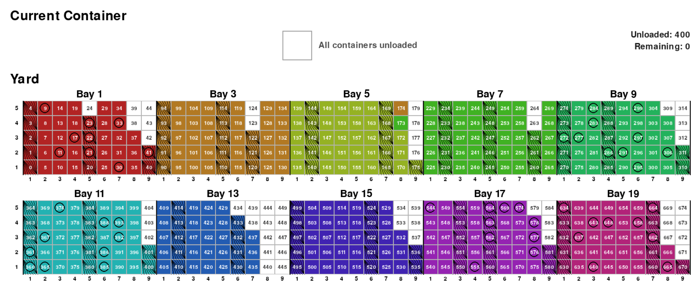

# Hierarchical Reinforcement Learning with Pointer Networks for Scalable Container Yard Stacking



This repo contains two separate, independent pipelines, split into their own
top-level directories:

- **`stack/`** — the container-**yard**-stacking problem (this thesis's focus):
  hierarchical RL with pointer networks. Documented below.
- **`stow/`** — the original vessel/ship stowage-planning problem (loading
  containers onto a ship). See [Stow](#stow) below.

## Installation

Install dependencies using `pyproject.toml` and uv.

## Stack

### Pretrained Models

Download pretrained models here: https://drive.google.com/drive/folders/1pjUggGEmB8jCeRyCO5HIxaIHGiA4wnli?usp=drive_link

After downloading move the flat and hierarchical folders inside the already existing `stack/models` folder.

### Getting Started

Use `stack/notebooks/explore.ipynb` to get started and run inference with trained models.

### Training

Use `stack/run.py` and its parameters to start training models. Example commands (run from the repo root):

For training Hierarchical RL model on small environments with all constraints (40 feet and IMO) on :
```
uv run stack/run.py --size small_with_margin --eval_freq 25000 --timesteps 100000 --joint_hierarchical --use_transformer --save_model --save_dir ./stack/models --save_filename ppo_joint_hier_small_imo40ft
```

For training Flat RL model on small environments with all constraints (40 feet and IMO) on :
```
uv run stack/run.py --size small_with_margin --eval_freq 25000 --timesteps 100000 --use_transformer --save_model --save_dir ./stack/models --save_filename ppo_joint_flat_small_imo40ft
```

### Major Files Overview

| File | Description |
|---|---|
| `stack/run.py` | CLI entry point that parses args, builds the env config, and launches training. |
| `stack/train.py` | Core training utilities: builds envs/models and runs training with sb3 callbacks. |
| `stack/utils.py` | Shared helpers: env factories, action-masking, and eval/checkpoint callbacks. |
| `stack/envs/stack_gym.py` | Gymnasium environment simulating container yard stacking (vessel->yard). |
| `stack/agents/hierarchical_rule_based_agent.py` | Heuristic baseline agents for yard stacking. |
| `stack/models/transformer_policy.py` | Transformer encoder and Pointer Network decoder implementation.|
| `stack/models/joint_hierarchical_policy.py` | Code for Hierarchical RL policy |

## Stow

The vessel/ship stowage-planning problem: loading containers onto a ship, as opposed
to stacking them in a yard. This code predates the Stack work above and is kept
separate under `stow/`.

| File | Description |
|---|---|
| `stow/main.py` | Small enumeration-solver demo on `stow/envs/stowage_gym.py`. |
| `stow/train_spge.py` | Training entry point for the Stow RL baselines (uses `stow/hpo_spge.py` for algo/env registries and config loading). |
| `stow/hpo_spge.py` | Hyperparameter optimization script; also defines the algorithm/environment registries and YAML config loader used by `train_spge.py`. |
| `stow/ilp_solver.py` / `stow/ilp_solver_mc.py` | ILP-based stowage solver baselines. |
| `stow/algorithms/` | Custom SB3-compatible algorithm implementations (A2C, DQN, QRDQN, TRPO) used as Stow baselines. |
| `stow/envs/` | Stowage-planning Gymnasium/PettingZoo environments. |
| `stow/configs/` | YAML configs consumed by `train_spge.py` / `hpo_spge.py`. |

Example training command (run from the repo root):
```
uv run stow/train_spge.py --config spge.ppo.yaml
```
